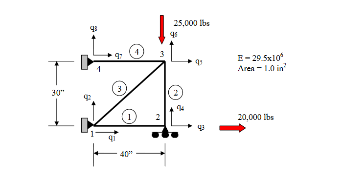

# Truss-Space
## What Is It?

Truss-Space is a simple 2-dimensional FEA solver written in Python. It works exclusively with line elements. This
project is mostly a fun engineering exercise. I would not recommend using this program for any serious engineering
problems.

## What Does It Do?
Truss-Space allows you to define a structure which consists of various line elements connected at nodes. You can then
apply forces and boundary conditions to these objects and then solve for the nodal displacements, elemental stresses,
and reaction forces in the supports. This can save a lot of time with large structures as it is often cumbersome to do
the laborious calculates for every member in a 30 beam truss.

## How Do I Use It?
Truss-Space is very simple to use. First, you must import the builder file to allow you to build a structure. This can
be done like so:
```python
from builder import *
```



*from http://www.unm.edu/~bgreen/ME360/Finite%20Element%20Truss.pdf*

Then you must initialize a structure. For an example, we will perform analysis on the structure pictured above. 
Theoretically one could have multiple structures in the same script if they wanted to.

To create a structure, you must initialize an instance of it's class. The constructor takes two arguments. One for
Young's modulus of the material that you are using and another for the cross sectional area of the line elements.
Make sure that the units are homogeneous as the script is completely unit-agnostic.
```python
E = 29.5 * 10 ** 6  # Young's modulus
A = 1  # cross sectional area of beam

myStructure = Structure(E, A)
```

Now that we have an object for our structure, we may now add elements. The method `Structure.add_element(start, end)`
can help us. As it's first argument it takes a tuple of length 2 which defines the coordinates of the line elements
starting point. The second argument is another length 2 tuple which is the coordinate of the end point. We can add 4
elements to the structure.

```python
myStructure.add_element((0, 0), (40, 0))
myStructure.add_element((40, 30), (40, 0))
myStructure.add_element((0, 0), (40, 30))
myStructure.add_element((0, 30), (40, 30))
```

Now that we have defined our line elements, we must tell the solver what the constraints at the nodes are. This is done
with boundary conditions. Boundary conditions have the following format:

```python
Structure.add_boundary_condition(node_number, (x_constraint, y_contraint))
```

The first argument is the index of the node in question. The second argument is a tuple which defines the constraint for
the displacement for that node in the x and y directions. These constrains can take two values. They can either equal
`0` or `'free'`. `0` means that that node cannot displace in that given direction. `'free'` means that that given node
is free to move in that direction with no restraint.

It is absolutely important that one defines boundary conditions for every single node in the structure. Let us go ahead
and define ours. One can see from the picture that node 1 is not free to move in either direction because it is at a
fixed support. We can reflect that in our code:

```python
myStructure.add_boundary_condition(1, (0, 0))
```

If we look at node 2, we can see that it is on a rolling support. This means that it is free to move in the x direction
but not in the y. Again, we can reflect this:

```python
myStructure.add_boundary_condition(2, ('free', 0))
```

Doing this for the rest of the nodes:

```python
myStructure.add_boundary_condition(3, ('free', 'free'))  # node is not attached to anything except for beams
myStructure.add_boundary_condition(4, (0, 0))  # attached to wall with fixed support
```

Now that our structure has the proper constraints on it's movement, we can define the forces. The format for this method
is quite simple:

```python
Structure.apply_force(node_number, force_x_component. force_y_component)
```

We can look again at the above picture and apply our forces like so:

```python
myStructure.apply_force(1, 0, 0)
myStructure.apply_force(2, 20000, 0)
myStructure.apply_force(3, 0, -25000)
myStructure.apply_force(4, 0, 0)
```

It is important that you declare a force for every node in the structure. If there is no force applied, then you must
still put zeros.

Before we can solve for the different values such as displacement, stresses, reactions, etc., we must solve for the
global stiffness matrix of the system. We can do this easily:

```python
myStructure.build_global_stiffness_matrix()
```

Now we may call methods to solve for various values of the structure. There are 3 in the library so far:

```python
myStructure.solve_displacements()  # finds the displacement of every node
myStructure.solve_stresses()  # calculates the axial stress in every element
myStructure.solve_reactions()  # computes the reaction force in each node. Will be zero if the node is not set to a 0
                               # displacement boundary condition.
```

It is worth noting that one will get an error if they try to solve for the stresses or reactions if they haven't solved
for the displacements yet. This is because the calculations for stresses and reactions both rely on the displacement 
values, so `Structure.solve_displacements()` must always be run.

Finally, to see our values, we can access them like so:
```python
displacements = myStructure.displacements
stresses = myStructure.stresses
reactions = myStructure.reactions
```

It should be trivial given these values to calculate other important numbers such as the axial force in each element, or
the Eigenvalue buckling modes, etc. This same analysis can be found in `main.py`.